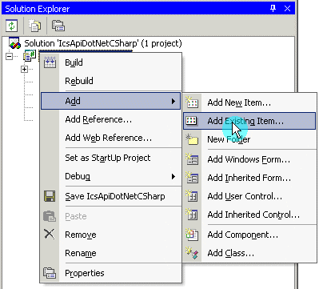
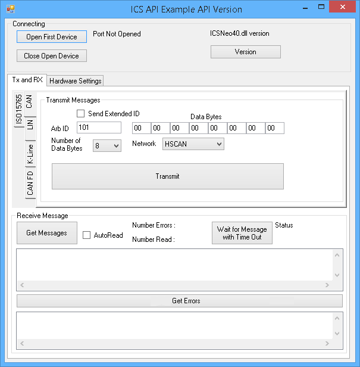

# Using the intrepidcs API in C# - intrepidcs API

To use the intrepidcs API in C# add the [`icsNeoClass.cs`](https://cdn.intrepidcs.net/guides/neoVIDLL/\_downloads/0f20729ed67e93491ce3dc561c785937/icsNeoClass.zip) Class into the C# project (figure 1). Right click on the solution and select “Add Existing Item” from the “Add” menu. Then, call the methods as defined in the WIN32 API Functions and Types Section of this document.

### Example

A C# Dot Net 2010 example (Figure 1) is included to show how the API all works together. The main project files are as follows: 1) the project file: IcsApiDotNetCSharp.sln 2) the form file : Form1.cs, and 3) the neoVI module : icsNeoClass.cs. All project files are included in the following file [`CSnet2010.zip`](https://cdn.intrepidcs.net/guides/neoVIDLL/\_downloads/9a99f8bde62128dff29eb5e06464e1c0/CSnet2010.zip). This project will open in Visual Studio 2010, 2012, 2013, 2015 and 2017.

The example shows how to open and close communication to the driver, send messages and read messages on the networks.

