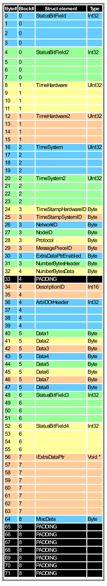

# Using an array instead of a message structure - intrepidcs API

In some programming environments (such as LabVIEW) it maybe inconvenient for you to access the message with a structure. In these cases you may use a byte array in place of the structure. Table 1 below lists the locations of message items in the byte array for a 64 bit version of the structure. The message structure is 8 byte aligned. Padding bytes are marked in black.

**Table 1 - Position of Message Elements in the Byte Array**

